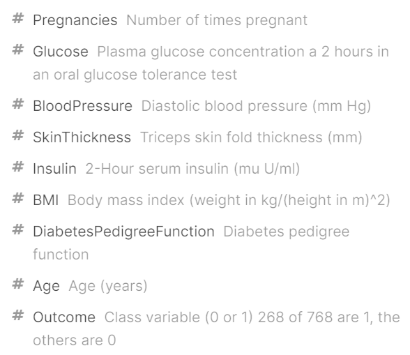

```{r setup, include=FALSE}
knitr::opts_chunk$set(echo = TRUE)
```

```{r, warning = FALSE, message = FALSE, echo = FALSE}
#plotting and exploring
library(tidyverse) #for plotting and summarizing
library(GGally) #for nice scatterplot matrix 
library(ggridges) #for joy/ridge plots
library(corrplot) #for basic correlation matrix plot
library(naniar) #for exploring missing values
library(pdp) #for partial dependence plots, MARS models
library(rpart.plot) #for plotting decision trees
library(vip) #for importance plots
library(pROC) #for ROC curves
library(plotROC) #for plotting ROC curves

#making things look nice
library(lubridate) #for nice dates
library(knitr) #for nice tables
library(scales) #for nice labels on graphs
library(gridExtra) #for arranging plots
library(broom) #for nice model output
library(janitor) #for nice names

#data
library(ISLR) #for data
library(moderndive) #for data
library(rattle) #weather data

#modeling
library(rsample) #for splitting data
library(recipes) #for keeping track of transformations
library(caret) #for modeling
library(leaps) #for variable selection
library(glmnet) #for LASSO
library(earth) #for MARS models
library(rpart) #for decision trees
library(randomForest) #for bagging and random forests

theme_set(theme_minimal())
```

## Introduction

# Dataset & data cleaning

This dataset was obtained from Kaggle.com. The goal is to predict whether or not the patients have diabetes or not. (All patient are females at least 21 years old of Pima Indian heritage.) An accurate description of variables is provided in the image below.



```{r, warning = FALSE, message = FALSE, echo = FALSE}
db <- read_csv("diabetes.csv")
```

```
db <- db %>%
  mutate(BMI=ifelse(BMI==0, NA, BMI),
         BloodPressure=ifelse(BloodPressure==0, NA, BloodPressure),
         Glucose=ifelse(Glucose==0, NA, Glucose),
         Insulin=ifelse(Insulin==0, NA, Insulin),
         SkinThickness=ifelse(SkinThickness==0, NA, SkinThickness),
         Outcome=ifelse(Outcome==0, 'NO', 'YES'))
```

```{r, warning = FALSE, message = FALSE, echo = FALSE}
set.seed(253)
db_split <- initial_split(db, prop = .7)
db_train <- training(db_split)
db_test <- testing(db_split)
```

```{r, warning = FALSE, message = FALSE, echo = FALSE, fig.width=12, fig.height=12}
db_train %>% 
  select_if(is.numeric)%>%
  pivot_longer(cols = everything(),
               names_to = "variable", values_to = "value") %>% 
  ggplot(aes(x = value)) +
  geom_histogram() +
  facet_wrap(vars(variable), scales = "free")
```

```{r, warning = FALSE, message = FALSE, echo = FALSE, fig.width=12, fig.height=6}
db_bmi<-db_train%>%
  ggplot(aes(x=BMI,y=Outcome))+
  geom_point(size = .5, alpha = .5)

db_preg<-db_train%>%
  ggplot(aes(x=Pregnancies,y=Outcome))+
  geom_point(size = .5, alpha = .5)

db_glu<-db_train%>%
  ggplot(aes(x=Glucose,y=Outcome))+
  geom_point(size = .5, alpha = .5)

db_blood<-db_train%>%
  ggplot(aes(x=BloodPressure,y=Outcome))+
  geom_point(size = .5, alpha = .5)

db_skin<-db_train%>%
  ggplot(aes(x=SkinThickness,y=Outcome))+
  geom_point(size = .5, alpha = .5)

db_insu<-db_train%>%
  ggplot(aes(x=Insulin,y=Outcome))+
  geom_point(size = .5, alpha = .5)

db_dia<-db_train%>%
  ggplot(aes(x=DiabetesPedigreeFunction,y=Outcome))+
  geom_point(size = .5, alpha = .5)

db_age<-db_train%>%
  ggplot(aes(x=Age,y=Outcome))+
  geom_point(size = .5, alpha = .5)

grid.arrange(db_age,db_blood, db_bmi, db_dia, db_glu, db_insu, db_preg, db_skin, nrow = 2) 
```

## Modeling

# 4-var

First of all, we choose four variable out of all the available variables, and use them to create a logistic model. We decided to choose blood pressure, BMI, glucose, and pregnancies.

####Fit the model
```{r}
# Set the seed
set.seed(253)
# Run the model
log_four_var <- train(
    as.factor(Outcome) ~ BloodPressure+BMI+Glucose+Pregnancies,
    data = db_train,
    method = "glm",
    family = "binomial",
    trControl = trainControl(method = "cv", number = 5),
    metric = "Accuracy",
    na.action = na.omit
)
# Model output
summary(log_four_var) %>% 
  coef() %>% 
  tidy() %>% 
  select(`.rownames`, Estimate) %>% 
  mutate(exp_coef = exp(Estimate))
```

####Cross-validated accuracy
```{r}
log_four_var$results$Accuracy
```
The cross-validated accuracy is 0.777704 for the four-variable model.

####Confusion matrix
```{r}
confusionMatrix(data = predict(log_four_var, type = "raw"), #predictions
                reference = as.factor(db_train$Outcome), #actuals
                positive = "1") 
```

####ROC curve and the AUC
```{r}
db_train %>% 
  mutate(PredOutcome =  predict(log_four_var, type = "prob")$"1") %>%
  ggplot(aes(d = Outcome, m = PredOutcome)) + 
  geom_roc(labelround = 2, size = 1,
           linealpha = .5, pointalpha = .8) +
  geom_abline(slope = 1, intercept = 0, color = "gray")
  
db_train %>% 
  mutate(PredOutcome=  predict(log_four_var, type = "prob")$"1") %>%
  roc(Outcome, PredOutcome) %>% 
  auc()
```


# all-var
####Fit the model
```{r}
# Set the seed
set.seed(253)
# Run the model
log_all_var <- train(
    as.factor(Outcome) ~ .,
    data = db_train,
    method = "glm",
    family = "binomial",
    trControl = trainControl(method = "cv", number = 5),
    metric = "Accuracy",
    na.action = na.omit
)
# Model output
summary(log_all_var) %>% 
  coef() %>% 
  tidy() %>% 
  select(`.rownames`, Estimate) %>% 
  mutate(exp_coef = exp(Estimate))
```

####Cross-validated accuracy
```{r}
log_all_var$results$Accuracy
```
The cross-validated accuracy is 0.792003 for the all-variable model.

####Confusion matrix
```{r}
confusionMatrix(data = predict(log_all_var, type = "raw"), #predictions
                reference = as.factor(db_train$Outcome), #actuals
                positive = "1") 
```

####ROC curve and the AUC
```{r}
db_train %>% 
  mutate(PredOutcome =  predict(log_all_var, type = "prob")$"1") %>%
  ggplot(aes(d = Outcome, m = PredOutcome)) + 
  geom_roc(labelround = 2, size = 1,
           linealpha = .5, pointalpha = .8) +
  geom_abline(slope = 1, intercept = 0, color = "gray")
#d = actual status, m = predicted probability
db_train %>% 
  mutate(PredOutcome=  predict(log_all_var, type = "prob")$"1") %>%
  roc(Outcome, PredOutcome) %>% 
  auc()
```

# Lasso
####Fit the model
```{r}
set.seed(253)
lambda_grid <- 10^seq(-4, -2, length = 100)
log_lasso <- train(
    as.factor(Outcome) ~ .,
    data = db_train,
    method = "glmnet",
    family = "binomial",
    trControl = trainControl(method = "cv", number = 5),
    tuneGrid = data.frame(alpha = 1, 
                          lambda = 10^seq(-4, -2, length = 100)),
    metric = "Accuracy",
    na.action = na.omit
)
log_lasso$results %>% 
  ggplot(aes(x = lambda, y = Accuracy)) +
  geom_line() +
  scale_x_log10()
```

####Cross-validated accuracy
```{r}
log_lasso$bestTune$lambda
log_lasso$results
```
The cross-validated accuracy is 0.7920030 for the lasso model.

####Confusion matrix
```{r}
confusionMatrix(data = predict(log_lasso, 
                               type = "raw"), #predictions
                reference = as.factor(db_train$Outcome), #actuals
                positive = "1")
```

####ROC curve and the AUC
```{r}
db_train %>% 
  mutate(PredOutcome =  predict(log_lasso, type = "prob")$"1") %>%
  ggplot(aes(d = Outcome, m = PredOutcome)) + 
  geom_roc(labelround = 2, size = 1,
           linealpha = .5, pointalpha = .8) +
  geom_abline(slope = 1, intercept = 0, color = "gray")
#d = actual status, m = predicted probability
db_train %>% 
  mutate(PredOutcome=  predict(log_lasso, type = "prob")$"1") %>%
  roc(Outcome, PredOutcome) %>% 
  auc()
```

# Classification tree

```{r}
set.seed(327)

db_tree_model <- train(
  as.factor(Outcome) ~ ., 
  data = db_train,
  method = "rpart",
  tuneGrid = data.frame(cp = 10^seq(-5, 1 , 
                                    length = 50)),
  trControl = trainControl(method = "cv", number = 5),
  metric = "Accuracy",
  na.action = na.omit
)
```

```{r}
#cv accuracy metrics
db_tree_model$results

#Examine the results in a plot
db_tree_model$results %>% 
  ggplot(aes(x = cp, y = Accuracy)) + 
  geom_point() + 
  geom_line() + 
  scale_x_log10()
```

```{r}
db_tree_model$bestTune
```

```{r}
confusionMatrix(data = predict(db_tree_model, type = "raw"), #predictions
                reference = as.factor(db_train$Outcome), #actuals
                positive = "1") 
```

```{r}
db_train %>% 
  mutate(PredOutcome =  predict(db_tree_model, type = "prob")$"1") %>%
  ggplot(aes(d = Outcome, m = PredOutcome)) + 
  geom_roc(labelround = 2, size = 1,
           linealpha = .5, pointalpha = .8) +
  geom_abline(slope = 1, intercept = 0, color = "gray")
```    
    
```{r}
#roc(actual_class ~ predicted_probability)
db_train %>% 
  mutate(PredOutcome =  predict(db_tree_model, type = "prob")$"1") %>%
  roc(Outcome ~ PredOutcome, data=.) %>% 
  auc()
```

# Random forest

```{r}
set.seed(327)
db_randf_model <- train(
  as.factor(Outcome) ~ .,
  data = db_train, 
  method = "rf",
  #trControl = trainControl(method = "cv",
  #                         number = 5),
  #tuneGrid = data.frame(mtry = 2),
  trControl = trainControl(method = "oob"),
  tuneGrid = data.frame(mtry = c(1, 2, 3, 4, 5, 6, 7, 8)),
  ntree = 200, #number of trees used, default is 500
  importance = TRUE, #for importance plots later
  nodesize = 5, #this is the default terminal node size for regression trees. Could set larger for smaller trees.
  metric = "Accuracy",
  na.action = na.omit
)
```

```{r}
#Examine the results in a plot
db_randf_model$results %>% 
  ggplot(aes(x = mtry, y = Accuracy)) + 
  geom_point() + 
  geom_line() 
```

```{r}
db_randf_model$results
db_randf_model$bestTune
```

```{r}
confusionMatrix(data = predict(db_randf_model, type = "raw"), #predictions
                reference = as.factor(db_train$Outcome), #actuals
                positive = "1") 
``` 

```{r}
db_train %>% 
  mutate(PredOutcome =  predict(db_randf_model, type = "prob")$"1") %>%
  ggplot(aes(d = Outcome, m = PredOutcome)) + 
  geom_roc(labelround = 2, size = 1,
           linealpha = .5, pointalpha = .8) +
  geom_abline(slope = 1, intercept = 0, color = "gray")
```    

```{r}
db_train %>% 
  mutate(PredOutcome =  predict(db_randf_model, type = "prob")$"1") %>%
  roc(Outcome ~ PredOutcome, data=.) %>% 
  auc()
```

```{r}
vip(db_randf_model$finalModel, num_features = 8, bar = FALSE) 
```

# Summary-train

## Applying to test data

# 4-var

```{r}
confusionMatrix(data = predict(log_four_var, newdata = db_test, type = "raw"),
                reference = as.factor(db_test$Outcome),
                positive = "1") 
```

```{r}
db_test%>%
  mutate(pred = predict(log_four_var,newdata=db_test,type="prob")$"1")%>%
  roc(as.numeric(db_test$Outcome)~pred,data=.) %>%
  auc()
```

# all-var

```{r}
confusionMatrix(data = predict(log_all_var, newdata = db_test, type = "raw"),
                reference = as.factor(db_test$Outcome),
                positive = "1") 
```

```{r}
db_test%>%
  mutate(pred = predict(log_all_var,newdata=db_test,type="prob")$"1")%>%
  roc(as.numeric(db_test$Outcome)~pred,data=.) %>%
  auc()
```

# Lasso

```{r}
confusionMatrix(data = predict(log_lasso, newdata = db_test, type = "raw"),
                reference = as.factor(db_test$Outcome),
                positive = "1") 
```

```{r}
db_test%>%
  mutate(pred = predict(log_lasso,newdata=db_test,type="prob")$"1")%>%
  roc(as.numeric(db_test$Outcome)~pred,data=.) %>%
  auc()
```

# Classification tree

```{r}
confusionMatrix(data = predict(db_tree_model, newdata = db_test, type = "raw"),
                reference = as.factor(db_test$Outcome),
                positive = "1") 
```

```{r}
db_test%>%
  mutate(pred = predict(db_tree_model,newdata=db_test,type="prob")$"1")%>%
  roc(as.numeric(db_test$Outcome)~pred,data=.) %>%
  auc()
```

# Random forest

```{r}
confusionMatrix(data = predict(db_randf_model, newdata = db_test, type = "raw"),
                reference = as.factor(db_test$Outcome),
                positive = "1") 
```

```{r}
db_test%>%
  mutate(pred = predict(db_randf_model,newdata=db_test,type="prob")$"1")%>%
  roc(as.numeric(db_test$Outcome)~pred,data=.) %>%
  auc()
```

# Summary-test

## Conclusion
