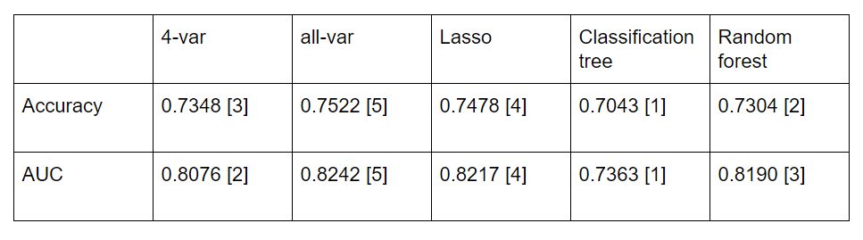

```{r setup, echo=FALSE,warning=FALSE,message=FALSE,include=FALSE}
knitr::opts_chunk$set(echo = TRUE)
```

```{r, echo=FALSE,warning=FALSE,message=FALSE,include=FALSE}
#plotting and exploring
library(tidyverse) #for plotting and summarizing
library(GGally) #for nice scatterplot matrix 
library(ggridges) #for joy/ridge plots
library(corrplot) #for basic correlation matrix plot
library(naniar) #for exploring missing values
library(pdp) #for partial dependence plots, MARS models
library(rpart.plot) #for plotting decision trees
library(vip) #for importance plots
library(pROC) #for ROC curves
library(plotROC) #for plotting ROC curves

#making things look nice
library(lubridate) #for nice dates
library(knitr) #for nice tables
library(scales) #for nice labels on graphs
library(gridExtra) #for arranging plots
library(broom) #for nice model output
library(janitor) #for nice names

#data
library(ISLR) #for data
library(moderndive) #for data
library(rattle) #weather data

#modeling
library(rsample) #for splitting data
library(recipes) #for keeping track of transformations
library(caret) #for modeling
library(leaps) #for variable selection
library(glmnet) #for LASSO
library(earth) #for MARS models
library(rpart) #for decision trees
library(randomForest) #for bagging and random forests

theme_set(theme_minimal())
```

## Introduction

Our dataset is obtained from Kaggle.com. The goal is to predict whether or not the patients have diabetes or not based on diagnostic measurements such as their blood pressure, BMI, and age. All patient are females at least 21 years old of Pima Indian heritage. An accurate description of variables is provided in the image below.


# Data cleaning

```{r, echo=FALSE,warning=FALSE,message=FALSE,include=FALSE}
db <- read_csv("diabetes.csv")
```

We notice that there might be some missing values because it does not make sense to have blood pressure of 0 or BMI or 0. Therefore, we use the mutate function and the median function to change these 0 values into the median value of the predictor variable. The median values are calculated after changing all 0 values to missing. Variables requiring modifications include BMI, BloodPressure, Glucose, Insulin, and SkinThickness, all of which containe values of 0 but should always be higher than 0.

```{r, echo=FALSE,warning=FALSE,message=FALSE,include=TRUE}
db <- db %>%
  mutate(BMI=ifelse(BMI==0, NA, BMI),
         BloodPressure=ifelse(BloodPressure==0, NA, BloodPressure),
         Glucose=ifelse(Glucose==0, NA, Glucose),
         Insulin=ifelse(Insulin==0, NA, Insulin),
         SkinThickness=ifelse(SkinThickness==0, NA, SkinThickness))
```

```{r, echo=FALSE,warning=FALSE,message=FALSE,include=TRUE}
db <- db %>%
  mutate(BMI=ifelse(is.na(BMI), median(db$BMI,na.rm = TRUE), BMI),
         BloodPressure=ifelse(is.na(BloodPressure), median(db$BloodPressure,na.rm = TRUE), BloodPressure),
         Glucose=ifelse(is.na(Glucose), median(db$Glucose,na.rm = TRUE), Glucose),
         Insulin=ifelse(is.na(Insulin), median(db$Insulin,na.rm = TRUE), Insulin),
         SkinThickness=ifelse(is.na(SkinThickness), median(db$SkinThickness,na.rm = TRUE), SkinThickness))
```

We use 70% of the dataset as our training data while 30% as our testing data. The proportion 0.7 is used instead of 0.5 because this dataset, with 768 observations, is not a large dataset and thus a larger proportion is needed to fit an accurate model.

```{r, echo=FALSE,warning=FALSE,message=FALSE,include=TRUE}
set.seed(253)
db_split <- initial_split(db, prop = .7)
db_train <- training(db_split)
db_test <- testing(db_split)
```

The following are graphs that summarize all the 9 variables. We can see that all the predictor variables are numerical while the outcome variable is categorical, with 0 meaning that the patient does not have diabetes and 1 meaning that the patient has diabetes. Four of the predictor variables, BloodPressure, BMI, Glucose, Insulin, and SkinThickness, are approximately normally distributed. They are also the ones that have values of 0 and are modified to the median values. The other three variables, Age, DiabetesPedigreeFunction, and Pregnancies, are right-skewed, showing the most patients in the dataset are young, have few pregnancies, and are not likely to have diabetes based on their family history.

```{r, echo=FALSE,warning=FALSE,message=FALSE,include=TRUE, fig.width=12, fig.height=12}
db_train %>% 
  select_if(is.numeric)%>%
  pivot_longer(cols = everything(),
               names_to = "variable", values_to = "value") %>% 
  ggplot(aes(x = value)) +
  geom_histogram() +
  facet_wrap(vars(variable), scales = "free")
```

We plot the relationship between the outcome variable and all predictor variables as well. For most variables, it is hard to tell how they affect the outcome. BMI, DiabetesPedigreeFunction, and Glucose are the three that have slightly more observable influence on the outcome. From the graph, our primary conjecture is that higher BMI, DiabetesPedigreeFunction, and Glucose are associated with having diabetes.

```{r, echo=FALSE,warning=FALSE,message=FALSE,include=TRUE, fig.width=12, fig.height=6}
db_bmi<-db_train%>%
  ggplot(aes(x=BMI,y=Outcome))+
  geom_point(size = .5, alpha = .5)

db_preg<-db_train%>%
  ggplot(aes(x=Pregnancies,y=Outcome))+
  geom_point(size = .5, alpha = .5)

db_glu<-db_train%>%
  ggplot(aes(x=Glucose,y=Outcome))+
  geom_point(size = .5, alpha = .5)

db_blood<-db_train%>%
  ggplot(aes(x=BloodPressure,y=Outcome))+
  geom_point(size = .5, alpha = .5)

db_skin<-db_train%>%
  ggplot(aes(x=SkinThickness,y=Outcome))+
  geom_point(size = .5, alpha = .5)

db_insu<-db_train%>%
  ggplot(aes(x=Insulin,y=Outcome))+
  geom_point(size = .5, alpha = .5)

db_dia<-db_train%>%
  ggplot(aes(x=DiabetesPedigreeFunction,y=Outcome))+
  geom_point(size = .5, alpha = .5)

db_age<-db_train%>%
  ggplot(aes(x=Age,y=Outcome))+
  geom_point(size = .5, alpha = .5)

grid.arrange(db_age,db_blood, db_bmi, db_dia, db_glu, db_insu, db_preg, db_skin, nrow = 2) 
```

## Modeling

### 4-var

First of all, we choose four variable out of all the available variables, and use them to create a logistic model. We decided to choose blood pressure, BMI, glucose, and DiabetesPedigreeFunction.

#### Fit the model

```{r}
# Set the seed
set.seed(253)
# Run the model
log_four_var <- train(
    as.factor(Outcome) ~ BloodPressure+BMI+Glucose+DiabetesPedigreeFunction,
    data = db_train,
    method = "glm",
    family = "binomial",
    trControl = trainControl(method = "cv", number = 5),
    metric = "Accuracy",
    na.action = na.omit
)

# Model output
summary(log_four_var) %>% 
  coef() %>% 
  tidy() %>% 
  select(`.rownames`, Estimate) %>% 
  mutate(exp_coef = exp(Estimate))
```

#### Cross-validated accuracy

```{r}
log_four_var$results$Accuracy
```

The cross-validated accuracy is 0.777704 for the four-variable model.

#### Confusion matrix

```{r}
confusionMatrix(data = predict(log_four_var, type = "raw"), #predictions
                reference = as.factor(db_train$Outcome), #actuals
                positive = "1") 
```

#### ROC curve and the AUC

```{r}
db_train %>% 
  mutate(PredOutcome =  predict(log_four_var, type = "prob")$"1") %>%
  ggplot(aes(d = Outcome, m = PredOutcome)) + 
  geom_roc(labelround = 2, size = 1,
           linealpha = .5, pointalpha = .8) +
  geom_abline(slope = 1, intercept = 0, color = "gray")
  
db_train %>% 
  mutate(PredOutcome=  predict(log_four_var, type = "prob")$"1") %>%
  roc(Outcome, PredOutcome) %>% 
  auc()
```

### all-var

#### Fit the model

```{r}
# Set the seed
set.seed(253)
# Run the model
log_all_var <- train(
    as.factor(Outcome) ~ .,
    data = db_train,
    method = "glm",
    family = "binomial",
    trControl = trainControl(method = "cv", number = 5),
    metric = "Accuracy",
    na.action = na.omit
)
# Model output
summary(log_all_var) %>% 
  coef() %>% 
  tidy() %>% 
  select(`.rownames`, Estimate) %>% 
  mutate(exp_coef = exp(Estimate))
```

#### Cross-validated accuracy

```{r}
log_all_var$results$Accuracy
```

The cross-validated accuracy is 0.792003 for the all-variable model.

#### Confusion matrix

```{r}
confusionMatrix(data = predict(log_all_var, type = "raw"), #predictions
                reference = as.factor(db_train$Outcome), #actuals
                positive = "1") 
```

#### ROC curve and the AUC

```{r}
db_train %>% 
  mutate(PredOutcome =  predict(log_all_var, type = "prob")$"1") %>%
  ggplot(aes(d = Outcome, m = PredOutcome)) + 
  geom_roc(labelround = 2, size = 1,
           linealpha = .5, pointalpha = .8) +
  geom_abline(slope = 1, intercept = 0, color = "gray")
#d = actual status, m = predicted probability
db_train %>% 
  mutate(PredOutcome=  predict(log_all_var, type = "prob")$"1") %>%
  roc(Outcome, PredOutcome) %>% 
  auc()
```

### Lasso

#### Fit the model

```{r}
set.seed(253)
lambda_grid <- 10^seq(-4, -2, length = 100)
log_lasso <- train(
    as.factor(Outcome) ~ .,
    data = db_train,
    method = "glmnet",
    family = "binomial",
    trControl = trainControl(method = "cv", number = 5),
    tuneGrid = data.frame(alpha = 1, 
                          lambda = 10^seq(-4, -2, length = 100)),
    metric = "Accuracy",
    na.action = na.omit
)

log_lasso$results %>% 
  ggplot(aes(x = lambda, y = Accuracy)) +
  geom_line() +
  scale_x_log10()
```

#### Cross-validated accuracy

```{r}
log_lasso$bestTune$lambda
log_lasso$results
```

The cross-validated accuracy is 0.7920030 for the lasso model.

#### Confusion matrix

```{r}
confusionMatrix(data = predict(log_lasso, 
                               type = "raw"), #predictions
                reference = as.factor(db_train$Outcome), #actuals
                positive = "1")
```

#### ROC curve and the AUC

```{r}
db_train %>% 
  mutate(PredOutcome =  predict(log_lasso, type = "prob")$"1") %>%
  ggplot(aes(d = Outcome, m = PredOutcome)) + 
  geom_roc(labelround = 2, size = 1,
           linealpha = .5, pointalpha = .8) +
  geom_abline(slope = 1, intercept = 0, color = "gray")
#d = actual status, m = predicted probability
db_train %>% 
  mutate(PredOutcome=  predict(log_lasso, type = "prob")$"1") %>%
  roc(Outcome, PredOutcome) %>% 
  auc()
```

# Classification tree

#### Fit the model

```{r}
set.seed(327)

db_tree_model <- train(
  as.factor(Outcome) ~ ., 
  data = db_train,
  method = "rpart",
  tuneGrid = data.frame(cp = 10^seq(-5, 1 , 
                                    length = 50)),
  trControl = trainControl(method = "cv", number = 5),
  metric = "Accuracy",
  na.action = na.omit
)
```

#### cp vs. Accuracy 

```{r}
db_tree_model$results %>% 
  ggplot(aes(x = cp, y = Accuracy)) + 
  geom_point() + 
  geom_line() + 
  scale_x_log10()
```

#### Cross-validated accuracy

```{r}
db_tree_model$bestTune
db_tree_model$results
```

#### Confusion matrix

```{r}
confusionMatrix(data = predict(db_tree_model, type = "raw"), #predictions
                reference = as.factor(db_train$Outcome), #actuals
                positive = "1") 
```

#### ROC curve and the AUC

```{r}
db_train %>% 
  mutate(PredOutcome =  predict(db_tree_model, type = "prob")$"1") %>%
  ggplot(aes(d = Outcome, m = PredOutcome)) + 
  geom_roc(labelround = 2, size = 1,
           linealpha = .5, pointalpha = .8) +
  geom_abline(slope = 1, intercept = 0, color = "gray")
```    
    
```{r}
#roc(actual_class ~ predicted_probability)
db_train %>% 
  mutate(PredOutcome =  predict(db_tree_model, type = "prob")$"1") %>%
  roc(Outcome ~ PredOutcome, data=.) %>% 
  auc()
```

# Random forest

#### Fit the model

```{r}
set.seed(327)
db_randf_model <- train(
  as.factor(Outcome) ~ .,
  data = db_train, 
  method = "rf",
  #trControl = trainControl(method = "cv",
  #                         number = 5),
  #tuneGrid = data.frame(mtry = 2),
  trControl = trainControl(method = "oob"),
  tuneGrid = data.frame(mtry = c(1, 2, 3, 4, 5, 6, 7, 8)),
  ntree = 200, #number of trees used, default is 500
  importance = TRUE, #for importance plots later
  nodesize = 5, #this is the default terminal node size for regression trees. Could set larger for smaller trees.
  metric = "Accuracy",
  na.action = na.omit
)
```

#### mtry vs. Accuracy  

```{r}
#Examine the results in a plot
db_randf_model$results %>% 
  ggplot(aes(x = mtry, y = Accuracy)) + 
  geom_point() + 
  geom_line() 
```

#### OOB accuracy

```{r}
db_randf_model$results
db_randf_model$bestTune
```

#### Confusion matrix

```{r}
confusionMatrix(data = predict(db_randf_model, type = "raw"), #predictions
                reference = as.factor(db_train$Outcome), #actuals
                positive = "1") 
``` 

#### ROC curve and the AUC

```{r}
db_train %>% 
  mutate(PredOutcome =  predict(db_randf_model, type = "prob")$"1") %>%
  ggplot(aes(d = Outcome, m = PredOutcome)) + 
  geom_roc(labelround = 2, size = 1,
           linealpha = .5, pointalpha = .8) +
  geom_abline(slope = 1, intercept = 0, color = "gray")
```    

```{r}
db_train %>% 
  mutate(PredOutcome =  predict(db_randf_model, type = "prob")$"1") %>%
  roc(Outcome ~ PredOutcome, data=.) %>% 
  auc()
```

#### Variable importance plot

```{r}
vip(db_randf_model$finalModel, num_features = 8, bar = FALSE) 
```

# Summary-train

## Applying to test data

After we fit all five models using the training data, we are going to examine the effect of each model on the test data. We primarily focus on the accuracy and the AUC value, and use statistics from the confusion matrix (including sensitivity and specificity) as references.

### 4-var

We get an accuracy of 0.7348 and an AUC of 0.8076 for this model.

```{r, echo=FALSE,warning=FALSE,message=FALSE,include=FALSE}
confusionMatrix(data = predict(log_four_var, newdata = db_test, type = "raw"),
                reference = as.factor(db_test$Outcome),
                positive = "1") 
```

```{r, echo=FALSE,warning=FALSE,message=FALSE,include=FALSE}
db_test%>%
  mutate(pred = predict(log_four_var,newdata=db_test,type="prob")$"1")%>%
  roc(as.numeric(db_test$Outcome)~pred,data=.) %>%
  auc()
```

### all-var

We get an accuracy of 0.7522 and an AUC of 0.8242 for this model. Both values are higher than those of the 4-var model, indicating that this model is a more accurate and better one.

```{r, echo=FALSE,warning=FALSE,message=FALSE,include=FALSE}
confusionMatrix(data = predict(log_all_var, newdata = db_test, type = "raw"),
                reference = as.factor(db_test$Outcome),
                positive = "1") 
```

```{r, echo=FALSE,warning=FALSE,message=FALSE,include=FALSE}
db_test%>%
  mutate(pred = predict(log_all_var,newdata=db_test,type="prob")$"1")%>%
  roc(as.numeric(db_test$Outcome)~pred,data=.) %>%
  auc()
```

### Lasso

We get an accuracy of 0.7478 and an AUC of 0.8217 for this model. Both values are higher than those of the 4-var model but lower than the all-var model, indicating that this model performs better than the 4-var model but not as good as the all-var model.

```{r, echo=FALSE,warning=FALSE,message=FALSE,include=FALSE}
confusionMatrix(data = predict(log_lasso, newdata = db_test, type = "raw"),
                reference = as.factor(db_test$Outcome),
                positive = "1") 
```

```{r, echo=FALSE,warning=FALSE,message=FALSE,include=FALSE}
db_test%>%
  mutate(pred = predict(log_lasso,newdata=db_test,type="prob")$"1")%>%
  roc(as.numeric(db_test$Outcome)~pred,data=.) %>%
  auc()
```

### Classification tree

We get an accuracy of 0.7043 and an AUC of 0.7363 for this model. Both values are the lowest of all models, indicating that this model is the least accurate and worst one.

```{r, echo=FALSE,warning=FALSE,message=FALSE,include=FALSE}
confusionMatrix(data = predict(db_tree_model, newdata = db_test, type = "raw"),
                reference = as.factor(db_test$Outcome),
                positive = "1") 
```

```{r, echo=FALSE,warning=FALSE,message=FALSE,include=FALSE}
db_test%>%
  mutate(pred = predict(db_tree_model,newdata=db_test,type="prob")$"1")%>%
  roc(as.numeric(db_test$Outcome)~pred,data=.) %>%
  auc()
```

### Random forest

We get an accuracy of 0.7304 and an AUC of 0.8190 for this model. It has the second smallest accuracy and the third smallest AUC.

```{r, echo=FALSE,warning=FALSE,message=FALSE,include=FALSE}
confusionMatrix(data = predict(db_randf_model, newdata = db_test, type = "raw"),
                reference = as.factor(db_test$Outcome),
                positive = "1") 
```

```{r, echo=FALSE,warning=FALSE,message=FALSE,include=FALSE}
db_test%>%
  mutate(pred = predict(db_randf_model,newdata=db_test,type="prob")$"1")%>%
  roc(as.numeric(db_test$Outcome)~pred,data=.) %>%
  auc()
```

# Summary-test



According to the summary table above, the all-variable model is our best choice. It is also not computationally too complicated as there are eight predictor values only and thus it is feasible one.

## Conclusion
